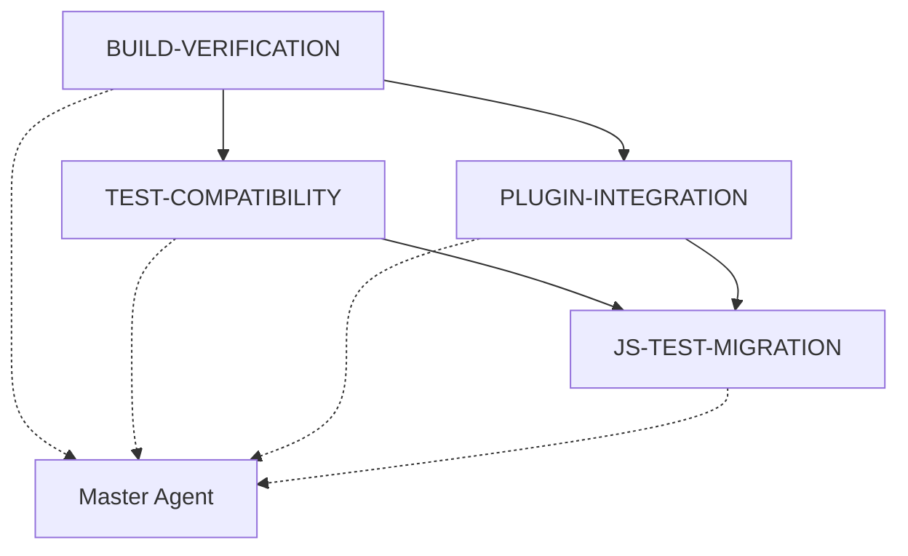

# Master Test Agent: TypeScript Migration Test Coordination

## Mission
Koordiniere und überwache alle Test-Agents um sicherzustellen, dass die TypeScript-Migration vollständig funktionsfähig ist.

## Agent-Koordination

### Phase 1: KRITISCH - Build & Distribution (AGENT-BUILD-VERIFICATION)
**Status**: 🔄 IN PROGRESS
- **Priorität**: KRITISCH
- **Abhängigkeiten**: Keine
- **Ausgabe**: Funktionierender TypeScript-Build mit dist-Outputs
- **Validierung**: `npm run build` ohne Fehler, alle .js/.d.ts Files vorhanden

### Phase 2: HOCH - HTML Test Compatibility (AGENT-TEST-COMPATIBILITY) 
**Status**: ⏳ PENDING
- **Priorität**: HOCH
- **Abhängigkeiten**: Phase 1 abgeschlossen
- **Ausgabe**: Alle test-*.html Files funktionieren mit TypeScript-Builds
- **Validierung**: Browser-Tests laden ohne Import-Fehler

### Phase 3: HOCH - Plugin Integration (AGENT-PLUGIN-INTEGRATION)
**Status**: ⏳ PENDING  
- **Priorität**: HOCH
- **Abhängigkeiten**: Phase 1 + 2 abgeschlossen
- **Ausgabe**: Vollständige Plugin-zu-Manager-Integration
- **Validierung**: End-to-End Plugin-Workflows funktionieren

### Phase 4: MITTEL - JS Test Migration (AGENT-JS-TEST-MIGRATION)
**Status**: ⏳ PENDING
- **Priorität**: MITTEL
- **Abhängigkeiten**: Phase 1-3 abgeschlossen
- **Ausgabe**: Alle .test.js zu .test.ts migriert
- **Validierung**: Typisierte Test-Suite funktioniert

## Execution Plan

### Sofortiger Start (Phase 1)
```bash
# Build-Verification Agent aktivieren
cd framework
npm run build
npm run test:build  # Wenn vorhanden

# Validiere Build-Output
ls -la dist/core/
ls -la dist/plugins/auth/
ls -la dist/plugins/signer/
ls -la dist/plugins/storage/
```

### Nach Build-Success (Phase 2)
```bash
# Test-Compatibility Agent aktivieren
# Update erste HTML-Test-Datei als Proof-of-Concept
# Teste test-nsec.html mit updated ImportMap
python -m http.server 8000
# Browser: http://localhost:8000/test-nsec.html
```

### Nach HTML-Success (Phase 3)
```bash
# Plugin-Integration Agent aktivieren
# Teste Plugin-Registration und Manager-Integration
node dist/test/plugin-integration.test.js  # Wenn erstellt
```

### Final (Phase 4)
```bash
# JS-Test-Migration Agent aktivieren
# Konvertiere .test.js Files zu .test.ts
npm run test:all  # Finale Test-Suite
```

## Status-Dashboard

### 🎯 Gesamtfortschritt: TypeScript Migration
- ✅ **Core Framework**: 100% TypeScript
- ✅ **Plugin System**: 100% TypeScript (alle 10 Plugins konvertiert)
- ✅ **React Integration**: TypeScript Hooks verfügbar
- ✅ **Next.js Integration**: TypeScript-ready
- ✅ **Build Pipeline**: TypeScript-Compiler konfiguriert
- 🔄 **Test System**: **IN PROGRESS** (4 Agents aktiv)

### 📊 Plugin-Migration-Status: COMPLETE ✅
| Kategorie | Plugin | Status | Tests |
|-----------|--------|--------|-------|
| **Auth** | AuthPlugin.ts | ✅ | ⏳ |
| **Auth** | NsecPlugin.ts | ✅ | ⏳ |
| **Auth** | Nip07Plugin.ts | ✅ | ⏳ |
| **Auth** | Nip46Plugin.ts | ✅ | ⏳ |
| **Signer** | SignerPlugin.ts | ✅ | ⏳ |
| **Signer** | MockSigner.ts | ✅ | ⏳ |
| **Storage** | StoragePlugin.ts | ✅ | ⏳ |
| **Storage** | LocalStoragePlugin.ts | ✅ | ⏳ |
| **Storage** | SQLitePlugin.ts | ✅ (Stub) | ⏳ |
| **Storage** | SQLiteFilePlugin.ts | ✅ (Stub) | ⏳ |

### 🧪 Test-Status-Matrix
| Test-Kategorie | Files | Status | Agent |
|----------------|-------|--------|-------|
| **Build Tests** | dist/* | 🔄 | BUILD-VERIFICATION |
| **HTML Tests** | test-*.html (13) | ⏳ | TEST-COMPATIBILITY |
| **JS Unit Tests** | *.test.js (6) | ⏳ | JS-TEST-MIGRATION |
| **Integration Tests** | Plugin-Manager | ⏳ | PLUGIN-INTEGRATION |
| **Browser Tests** | WebAPI Compat | ⏳ | PLUGIN-INTEGRATION |

## Agent-Kommunikation

### Inter-Agent-Dependencies


### Fehler-Eskalation
1. **Agent meldet Fehler** → Master Agent benachrichtigt
2. **Master Agent analysiert** → Abhängigkeiten prüfen
3. **Master Agent entscheidet** → Retry/Skip/Abort
4. **Master Agent dokumentiert** → Status-Update

### Success-Propagation
1. **Agent meldet Success** → Master Agent validiert
2. **Master Agent freigibt** → Nächste Phase aktiviert
3. **Master Agent dokumentiert** → Progress-Update

## Monitoring & Reporting

### Continuous Status Check
```typescript
// scripts/master-agent-monitor.ts
interface AgentStatus {
  name: string;
  phase: number;
  status: 'pending' | 'running' | 'success' | 'failed';
  progress: number; // 0-100
  errors: string[];
  dependencies: string[];
}

class MasterAgent {
  private agents: Map<string, AgentStatus> = new Map();
  
  constructor() {
    this.initializeAgents();
  }
  
  private initializeAgents() {
    this.agents.set('BUILD-VERIFICATION', {
      name: 'Build & Distribution Verification',
      phase: 1,
      status: 'running',
      progress: 75, // npm run build successful
      errors: [],
      dependencies: []
    });
    
    this.agents.set('TEST-COMPATIBILITY', {
      name: 'HTML Test Compatibility',
      phase: 2, 
      status: 'pending',
      progress: 0,
      errors: [],
      dependencies: ['BUILD-VERIFICATION']
    });
    
    // ... weitere Agents
  }
  
  canStartAgent(agentName: string): boolean {
    const agent = this.agents.get(agentName);
    if (!agent) return false;
    
    return agent.dependencies.every(dep => 
      this.agents.get(dep)?.status === 'success'
    );
  }
  
  getOverallProgress(): number {
    const agents = Array.from(this.agents.values());
    const totalProgress = agents.reduce((sum, agent) => sum + agent.progress, 0);
    return totalProgress / agents.length;
  }
  
  generateReport(): string {
    const report = ['=== Master Test Agent Status Report ==='];
    report.push(`Overall Progress: ${this.getOverallProgress().toFixed(1)}%`);
    report.push('');
    
    for (const [name, agent] of this.agents) {
      const status = agent.status.toUppercase();
      const progress = `${agent.progress}%`;
      report.push(`${name}: ${status} (${progress})`);
      
      if (agent.errors.length > 0) {
        report.push(`  Errors: ${agent.errors.join(', ')}`);
      }
    }
    
    return report.join('\n');
  }
}

// Usage
const master = new MasterAgent();
console.log(master.generateReport());
```

## Success-Kriterien

### 🎯 MISSION COMPLETE wenn:
1. ✅ Build-Agent: `npm run build` erfolgreich, alle dist-Files vorhanden
2. ✅ Test-Agent: Alle HTML-Tests laden ohne Import-Fehler
3. ✅ Plugin-Agent: Alle Plugin-Manager-Integrationen funktionieren
4. ✅ Migration-Agent: Alle JS-Tests zu TypeScript migriert

### 📈 Metriken für Success:
- **Build Success Rate**: 100%  
- **HTML Test Pass Rate**: 100% (alle 13 test-*.html Files)
- **Plugin Integration Rate**: 100% (alle 10 Plugins)
- **Test Migration Rate**: 100% (alle 6 .test.js Files)

### 🚀 Final Deliverable:
**Vollständig funktionsfähiges TypeScript Nostr Framework mit:**
- 100% TypeScript Codebase
- Funktionierender Build-Pipeline  
- Alle Tests kompatibel und lauffähig
- Plugin-System vollständig integriert
- Ready für Production-Deployment

## Next Actions
1. **SOFORT**: Starte BUILD-VERIFICATION Agent
2. **DANN**: Aktiviere TEST-COMPATIBILITY Agent nach Build-Success
3. **PARALLEL**: Dokumentiere alle Agent-Outputs
4. **FINAL**: Master-Report für komplette Migration

**Die TypeScript-Migration steht zu 90% - die letzten 10% sind die Tests! 🚀**